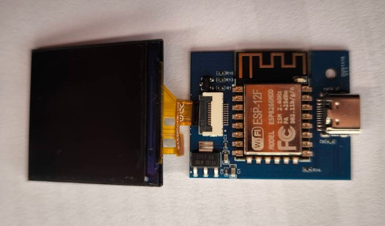

# GeekMagic SmallTV ESP8266 Custom Firmware (v3.5.0)

A native C++ firmware project for the **GeekMagic SmallTV** device (ESP8266 ESP-12F chip with a ST7789 IPS 240x240 LCD screen). Enhanced with properly composited Thai-language rendering, a Wi-Fi Manager control system, live weather and gold-price data from real APIs, multiple dashboard widget types (including QR/PromptPay), and over-the-air (OTA) firmware updates via a web page.

---

## 📌 Key Features
- 🇹🇭 **Full Thai font rendering system (178 glyphs):** supports tone marks and upper/lower vowels (combining marks) correctly stacked over consonants, renderable at multiple sizes (Scale 1x-3x depending on widget type)
- 📶 **Smart Wi-Fi Manager (EEPROM):** scans for Wi-Fi and configures via a web page; the board permanently remembers settings in EEPROM (auto-disables AP Mode once connected)
- 🕒 **NTP Time Sync:** Thai time (UTC+7) stays rock steady, with large clear digits
- 🥇 **XAU/USD Gold Widget:** fetches gold price from a real API every 5 minutes; green when higher than the previous round, red when lower
- 🌤️ **Weather from a real API:** temperature and weather conditions in Thai from open-meteo every 10 minutes (automatically converts city name to coordinates, with lat/lon cached in EEPROM)
- 📶 **Wi-Fi Auto-Reconnect:** `loop()` watches connection status every 2 seconds, retries every 15 seconds, and opens a fallback AP to let you fix settings if disconnected for more than 2 minutes
- 📊 **Mini Dashboard from JSON:** push `POST /api/draw` and the device draws the entire screen itself. Supports candlestick/column/bar/line/donut-pie charts, KPIs, gauges, Thai text, and **QR code (v3.5.0)** — everything autoscales automatically, without writing a single byte to flash. Switch back to the clock screen with `/api/mode`
- 📱 **QR Code + PromptPay (v3.5.0):** encodes a QR code (VERSION 7 / ECC-L) directly from text, or automatically assembles a PromptPay payload from a phone number/national ID + amount, with the device temporarily dimming the screen while showing the QR to make it easier for a phone camera to focus
- 💡 **Screen brightness adjustable from the web page:** a 5-100% slider that saves to EEPROM immediately
- ⚡ **OTA Firmware Update:** update to new firmware via a `.bin` file straight from a web browser, no cable needed
- 🔒 **Password-protected web page:** every endpoint including OTA and restart requires HTTP Basic Auth, with an on-screen warning if the default password is still in use

---

## 🔌 LCD Screen Pin Configuration (Hardware Pinout)
The GeekMagic SmallTV board has no CS pin (tied to GND), so the following wiring is required:

| ST7789 Display Pin | ESP8266 (NodeMCU) Chip Pin | Details |
|---|---|---|
| **MOSI / SDA** | GPIO 13 (D7) | SPI Data |
| **CLK / SCLK** | GPIO 14 (D5) | SPI Clock |
| **DC** | GPIO 0 (D3) | Command / Data |
| **RST** | GPIO 2 (D4) | Reset |
| **BL (Backlight)** | GPIO 5 (D1) | Active LOW via PWM (`analogWriteRange(1023)`) — 0 = brightest / 1023 = fully off |
| **CS (Chip Select)** | *Tied to GND* | Must set **SPI Mode 3** in the code |

---

## 🔌 Pinout for Flashing the Firmware (Flashing Connection Pinout)
Because the GeekMagic SmallTV clock board has no onboard USB-to-Serial chip (the on-board USB-C port only carries 5V power), the first-time programming requires wiring the Tx/Rx pins through an external serial converter, such as **NodeMCU Passthrough** (by soldering or probing the pins on the back of the clock board's case), as follows:

### 1. Pin Connection Table (NodeMCU Passthrough)
| Pin on the SmallTV Clock Board | Pin on the NodeMCU Board | Details |
|---|---|---|
| **TXD0** | **RX** (GPIO3) | Transmit signal |
| **RXD0** | **TX** (GPIO1) | Receive signal |
| **GND** | **GND** | Common ground |
| **5V / VCC** | **VU / 5V** | System power |
| **GPIO0** (FLASH) | **GND** *(hold only while booting)* | **Important:** must be pulled to ground while powering on to enter **Bootloader Mode** |
| *None* | **NodeMCU RST to GND** | **Very important:** the NodeMCU's own ESP8266 RST must be tied to GND to halt that chip (it's used purely as a USB-to-Serial passthrough) |

### 2. Wiring Diagrams and Actual Connection Points
We extracted the pinout from the connection points on the back of the board and prepared the wiring diagrams shown below:

- **Pin locations on the back of the clock board case (GeekMagic Board Pins):**

  
  

- **Actual wiring via NodeMCU Passthrough Mode:**

  

---

## 🔗 Reference Sources
This project draws on and builds upon the following key external references:
1. **Home Assistant Forum - GeekMagic Thread:**
   [Installing ESPhome on GEEKMAGIC Smart Weather Clock](https://community.home-assistant.io/t/installing-esphome-on-geekmagic-smart-weather-clock-smalltv-pro/618029/5) *(helped confirm the pinout and the use of SPI Mode 3)*
2. **GitHub Repository - ViToni:**
   [esphome-geekmagic-smalltv](https://github.com/ViToni/esphome-geekmagic-smalltv)
3. **GitHub Repository - Adrien Brault:**
   [geekmagic-hacs](https://github.com/adrienbrault/geekmagic-hacs)
4. **GitHub Repository - bvweerd:**
   [geekmagic-tv-esp8266](https://github.com/bvweerd/geekmagic-tv-esp8266) *(clarified the LCD configuration and build_flags for the native C++ ESP8266 firmware)*

---

## 🌐 Live Weather and Gold Price Data (Live Data APIs)

Since v3.1.0 the values on screen are no longer hardcoded. Both are fetched from real APIs, no API key required.

| Data | Endpoint | Protocol | Fetch interval |
|---|---|---|---|
| Coordinates from city name | `geocoding-api.open-meteo.com` | HTTP | Once, then cached in EEPROM |
| Temperature + weather | `api.open-meteo.com` | HTTP | Every 10 minutes |
| Gold price XAU/USD | `api.gold-api.com` | HTTPS | Every 5 minutes |

**Converting city name to coordinates:** enter a city name in the **🏙️ City** card on the web page. The device geocodes it once and stores the lat/lon in EEPROM; subsequent rounds hit the weather API directly, skipping the geocoding step.

**Gold price color:** compared against the price fetched in the previous round — green when higher, red when lower. The very first round after boot has nothing to compare against, so it stays white.

**When a fetch fails:** the previous value stays on screen (no dash or blank value), but a **yellow dot** marks the data as stale, and the device will keep retrying every 1 minute until it succeeds.

**Force a refresh now:** press the **🔄 Refresh Data** button on the web page (calls `GET /refresh`, requires auth) instead of waiting for the next cycle.

> **Note:** fetching the gold price is HTTPS, which consumes roughly 16-22 KB of heap during the TLS handshake. The firmware therefore skips that round if free heap drops below 24 KB, and never fetches weather and gold in the same `loop()` cycle, to avoid overlapping RAM usage peaks.

---

## 📊 Mini Dashboard from JSON Template (v3.2.0)

Since v3.2.0, you can push a JSON payload to draw the entire dashboard screen, replacing sending a full JPEG image. This means **it never writes to flash at all** — no need to worry about flash wear — and because the frame lives only in RAM, a reboot automatically returns to the clock screen.

### Endpoints

| Endpoint | Method | What it does |
|---|---|---|
| `/api/draw` | POST | Accepts a JSON template and draws the whole screen (body up to 6144 bytes) |
| `/api/mode?to=clock` | GET | Return to the clock screen |
| `/api/mode?to=dashboard` | GET | Redraw the same frame from RAM (responds 409 if nothing has been pushed yet) |
| `/api/mode?to=toggle` | GET | Toggle between the two |

All of these require HTTP Basic Auth, same as every other endpoint.

### Supported Widgets

| `type` | What it does | Key fields |
|---|---|---|
| `candles` | OHLC candlestick chart, autoscaled — finds the high/low range of the data set and maps it into the available height, with max/min price labels on the right edge. Up candles are green, down candles are red | `data: [[o,h,l,c], ...]`, up to 40 candles (excess is dropped from the oldest end, keeping the newest) |
| `column` | Vertical bar chart, in chronological order | `data: [v, ...]` |
| `bar` | Horizontal bar chart, for comparing rankings between items | `data: [v, ...]`, `values` (shows numeric labels on the bars) |
| `line` / `sparkline` | Line/trend chart (`sparkline` has no frame/labels unless explicitly provided) | `data: [v, ...]` |
| `donut` / `pie` | Proportion of a total (`pie` is a `donut` with `hole=0` as the default) | `data: [v, ...]`, `hole` (center hole %, 0-95) |
| `kpi` | A single summary number with a label | `value` or `data`, `label`, `text` |
| `gauge` | A single-value horizontal gauge bar | `value`, `min`/`max` (must be provided together to pin the scale) |
| `title` / `text` | Thai text via the 178-glyph renderer, `size` selectable 1-3 (`title` anchors to the top of the screen at 2x size without needing coordinates) | `text` |
| `rect` / `hline` | Rectangle / horizontal line, for layout | `x,y,w,h`, `fill` |
| `qr` | QR code, fixed at VERSION 7 / ECC-L (45x45 module) — see the [QR Code + PromptPay](#-qr-code--promptpay-v350) section | `text` or `promptpay_id`/`promptpay_amount` |

Every chart type (`candles`/`column`/`bar`/`line`/`donut`) accepts `min`/`max` to pin the scale yourself (omit for autoscale), and `threshold`+`color2` to switch color for points beyond a threshold.

`color` accepts both color names (`red`, `green`, `orange`, `cyan`, `grey`, etc.) and `#RRGGBB`.

### Example

```bash
curl --user admin:yourpass -X POST http://<device-ip>/api/draw \
  -H 'Content-Type: application/json' \
  --data-raw '{
    "widgets": [
      {"type": "title", "text": "Gold XAU/USD", "color": "orange"},
      {"type": "candles", "x": 5, "y": 40, "w": 230, "h": 140,
       "data": [[2610,2618,2604,2615], [2615,2622,2611,2612], [2612,2620,2606,2618]]},
      {"type": "text", "text": "$2,618.00", "y": 195, "size": 2, "color": "green"}
    ]
  }'
```

Quick test with the prepared script (pushes 24 candlesticks, then toggles the mode for you to see):

```bash
./scripts/test_dashboard.sh 192.168.1.50 admin yourpass
```

### AI Token Usage Report Dashboard

`scripts/ai_tokens_dashboard.py` reads Claude Code transcripts from `~/.claude/projects/*/*.jsonl`,
sums up tokens per day (deduplicated by `message.id`), then pushes them to the screen as a bar chart.

```bash
python scripts/ai_tokens_dashboard.py --dry-run          # preview the payload before sending
python scripts/ai_tokens_dashboard.py 192.168.1.50 admin yourpass
python scripts/ai_tokens_dashboard.py --metric total --days 30 192.168.1.50 admin yourpass
```

`--metric` has three options:

| metric | what it counts | best for |
|---|---|---|
| `billable` (default) | input + output + cache write | closest to actual cost |
| `total` | includes cache read as well | seeing total throughput through the model |
| `output` | only what the model wrote out | seeing actual work performed |

No firmware changes needed — the script borrows the `candles` widget to draw a bar chart, sending OHLC as `[0, v, 0, v]`,
making `open == close == v` produce a solid bar from base 0, and since `close >= open` the device always draws it green.

### Remaining Quota Dashboard

`scripts/ai_quota_dashboard.py` reads quota data cached locally by each tool on this machine only.
It never calls any API and never touches credentials.

```bash
python scripts/ai_quota_dashboard.py --dry-run
python scripts/ai_quota_dashboard.py 192.168.1.50 admin yourpass
```

| Tool | Data source | Status |
|---|---|---|
| Codex | `~/.codex/sessions/**/*.jsonl` → `token_count.rate_limits` | ✅ has `used_percent` + `window_minutes` + `resets_at` |
| Claude Code | `~/.claude/projects/*/*.jsonl` | ❌ doesn't cache quota (`rateLimits` is `null` for every entry) |
| Antigravity | `~/.antigravity-agent/cloud_accounts.db` column `quota_json` | ❌ encrypted as `iv:salt:ciphertext`, requires a key from the keystore |

Tools without data show `n/a` rather than guessing, and no zero-value bar is drawn, since a 0 bar would read as "0% used", which would be misleading.

Two tricks used to make `drawCandles()` behave like a gauge:

- **Pin the scale** by setting `lo=0, hi=100` on every bar, otherwise autoscale would make a 94% bar and a 100% bar look the same height.
  The right-axis label then reads `100`/`0` directly, and a wick that reaches the ceiling becomes a visual indicator of remaining headroom.
- **Control the color** via the `cl >= op` condition in the firmware, not a color field. Green uses `[0,100,0,v]`;
  above 90% it switches to `[v,100,0,0]` to get the same bar in red.

**Snapshots are not realtime** — Codex only writes values while you're actively chatting with it. If it's been idle, the numbers go stale.
The script therefore displays a snapshot age alongside the value, and drops any window whose snapshot is older than the window length itself
(e.g. a 5-hour window recorded a month ago has reset many times since, so it's meaningless).

The script checks the device's limits before every push (32-byte limit per text string, 240px screen width,
cap of 40 bars / 4 text strings / 6144-byte body); if exceeded, it errors out with the reason rather than letting garbage appear on screen.

### Things Worth Knowing

- **10-minute TTL** — if no new frame is pushed within 10 minutes, the device automatically returns to the clock screen, so stale data doesn't linger if the source goes down
- **Each frame must be self-contained** — every push clears all previous widgets first; it does not draw on top of the existing frame
- **While in dashboard mode, the device still fetches weather and gold on its normal schedule**, just doesn't draw them to screen — switching back to the clock screen shows the latest values immediately
- **Heap guard** — if free heap drops below ~16 KB (`DASH_DOC_SIZE` 8192 + an 8000-byte buffer) at push time, it responds `503` asking you to retry, rather than letting the document allocation fail mid-way
- Text is limited to 4 items per frame, no longer than 31 characters (counted in bytes; each Thai character takes 3 bytes)

---

## 📱 QR Code + PromptPay (v3.5.0)

The `qr` widget encodes a QR code fixed at **VERSION 7 / ECC-L** (45x45 module grid), and accepts data in two ways:

**Option 1 — send `text` directly**, for URLs or general text; the device encodes exactly what's sent, unmodified

**Option 2 — send `promptpay_id` (+ `promptpay_amount` if you want to pin an amount)**, and the device assembles the full EMVCo/Thai QR Payment payload (tag-length-value + CRC16) for you — no need to compute the CRC or TLV on the sending side:
- `promptpay_id` accepts either a 10-digit phone number starting with 0 (e.g. `0812345678`) or a 13-digit national ID number
- `promptpay_amount` — include it if you want to pin the payment amount into the QR itself; omit it (or set `0`) to let the payer enter the amount themselves
- if `promptpay_id` doesn't match either format, that widget is silently skipped (other widgets in the frame still draw normally)

```json
{
  "type": "qr",
  "promptpay_id": "0812345678",
  "promptpay_amount": 150.00,
  "x": 20, "y": 30, "w": 200, "h": 200,
  "color": "black", "color2": "white"
}
```

**About brightness:** full brightness is too bright for a phone camera (makes focusing/scanning fail), so the device temporarily dims itself to 30% any time the frame contains a `qr` widget with a payload, then restores the brightness setting you configured once you switch back to the clock screen (normal brightness is set via the **💡 Screen Brightness** card on the web page)

> Before making a real payment, always scan and verify the recipient name/amount in your banking app first

---

## 📥 Getting the Firmware File (.bin)

The binary file is not stored in this repo (excluded via `.gitignore` to keep the repo from bloating). You can get it two ways:

**Option 1 — Download from the Releases page (recommended)**
Go to this repo's **Releases** page and download the attached file for the latest version:
- `SDP_v3.5.0.bin` — usable both for initial Serial flashing and for OTA updates

**Option 2 — Compile it yourself with PlatformIO (recommended for developers)**
The project is already set up for PlatformIO; all libraries are specified in `platformio.ini` and download automatically:

```bash
pio run
```

The `.bin` file gets built at `.pio/build/geekmagic/firmware.bin`, and a post-build script automatically copies it to `build_esp8266/SDP_v<version>.bin` (reading the version number from `FW_VERSION` in the source)

Other frequently used commands:

```bash
pio run -t upload --upload-port COM3
```

```bash
pio device monitor -p COM3
```

**Option 3 — Compile with Arduino IDE**
Open `smart_clock_esp8266/smart_clock_esp8266.ino` (select an ESP8266-family board with 4MB flash size), then run **Export Compiled Binary**. You'll need to install the `Adafruit GFX Library`, `Adafruit ST7735 and ST7789 Library`, `Adafruit BusIO`, and `ArduinoJson` (version 6.x) libraries via the Library Manager before compiling.

---

## 🔒 Web Page Password (Web Authentication)

Since v3.0.0, every endpoint is protected with **HTTP Basic Auth**, including `/update_ota` and `/restart`, which are the highest-risk endpoints.

**Factory default credentials:**

| Field | Value |
|---|---|
| Username | `admin` |
| Password | `smartclock` |

⚠️ **Change this immediately after setup.** While the default password is still in use, the device warns you in two places: a red `[!PW]` badge in the top-right corner of the LCD screen, and an orange banner on the web page. Change it from the **🔒 Web Page Password** card (new password must be at least 8 characters).

**If you forget the password:** the device has no reset button. You'll need to wipe EEPROM by connecting the flashing wires and running `erase-flash`, per the steps below. All saved settings, including Wi-Fi, will be lost as well.

> **Security note:** Basic Auth sends the password base64-encoded over plain HTTP, which can be intercepted by anyone sniffing packets on the same network. This is adequate for a home network, but this device's port should not be exposed to the internet.

---

## 🛠️ Steps to Flash the Firmware

### 1. First-Time Flashing via NodeMCU Cable (Serial Flash)
1. Wire everything up per the table above (including **GPIO0 -> GND** and **NodeMCU RST -> GND**)
2. Plug the USB cable into your computer (the computer will see it as the NodeMCU's COM port, e.g. `COM3`)
3. Open a PowerShell window and run the following commands:

```powershell
# 1. Erase all existing memory contents
C:\Python312\python.exe -m esptool --chip esp8266 --port COM3 --baud 115200 erase-flash

# 2. Flash the new firmware onto the chip (adjust the path to match where you placed the .bin file)
C:\Python312\python.exe -m esptool --chip esp8266 --port COM3 --baud 115200 write-flash 0x0 "build_esp8266/SDP_v3.5.0.bin"
```

### 2. Over-the-Air Update Method (OTA Update)
Once the board is connected to Wi-Fi:
1. Open a web browser to the clock's IP address (e.g. `http://192.168.1.139/` or `http://192.168.4.1/` in AP Mode), then enter the username and password per the [Web Page Password](#-web-page-password-web-authentication) section
2. Go to the **🚀 Update Firmware (OTA)** section
3. Select the latest version's update file: `SDP_v3.5.0.bin`
4. Press **⚡ Upload .bin** — the device will restart into the new version immediately

---

## 📂 Main Project Folder Structure
```text
smart_clock/
├── smart_clock_esp8266/
│   ├── smart_clock_esp8266.ino   # Main C++ source code running on the ESP8266 board
│   └── ThaiFont.h                # Pixel data for the 178-glyph Thai font
├── scripts/
│   ├── copy_firmware.py          # post-build hook that copies the .bin to build_esp8266/
│   ├── make_ca_bundle.py         # tool for resolving TLS inspection issues (see troubleshooting section)
│   ├── test_dashboard.sh         # pushes /api/draw to test the mini dashboard on real hardware
│   ├── ai_tokens_dashboard.py    # aggregates daily AI token usage from transcripts and pushes it to the screen
│   └── ai_quota_dashboard.py     # reads remaining quota cached locally, then pushes it to the screen
├── images/                       # wiring diagrams and pinout images
├── platformio.ini                # ESP8266 build configuration (board = esp12e)
├── build_esp8266/                # destination for self-compiled .bin files (not stored in the repo)
├── .gitignore                    # excludes build artifacts and secrets from the repo
└── README.md                     # this usage guide file
```

---

## 🩺 Common Troubleshooting

### `pio run` fails with `HTTPClientError` while installing the platform
This happens on machines with TLS-intercepting software in the middle (Norton Web/Mail Shield, Zscaler, corporate proxies). These programs issue fake certificates in place of real ones. The `requests` library used by PlatformIO only trusts the CA set bundled with `certifi`, which doesn't include that root CA, so verification fails with `CERTIFICATE_VERIFY_FAILED` (note that `curl` and browsers still work fine, since they read from the Windows certificate store).

The fix is to build a CA bundle that merges the root CAs from the Windows store with certifi's:

```bash
python scripts/make_ca_bundle.py
```

Then set the environment variable before running `pio` (the script will print the correct path for you):

```bash
export REQUESTS_CA_BUNDLE="$HOME/.platformio/win-ca-bundle.pem"
```

On PowerShell:

```powershell
$env:REQUESTS_CA_BUNDLE = "$env:USERPROFILE\.platformio\win-ca-bundle.pem"
```

### Screen doesn't turn on, or shows only white
Check that **SPI Mode 3** is set in the code (`tft.init(240, 240, SPI_MODE3)`), since the CS pin is permanently tied to GND, and the backlight is **Active LOW** — `digitalWrite(TFT_BL, LOW)` turns it on.

### Can't flash / esptool can't find the chip
You must pull **GPIO0 to GND while powering on** to enter bootloader mode, and if using a NodeMCU as the USB-to-Serial converter, you must tie the **NodeMCU's own RST to GND** to stop that chip from running and interfering.

---
*Built and fully tested together with the USER for sustainable project development 🇹🇭*
