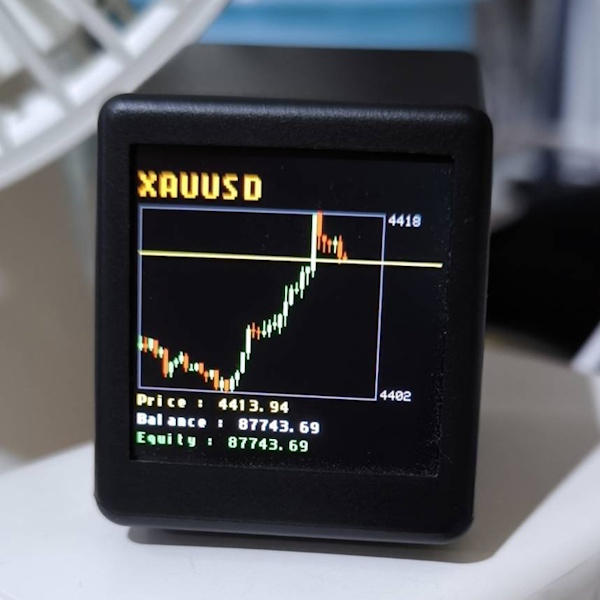

# SmartBox Candle Visualizer EA - Setup Guide



## ภาษาไทย

### ขั้นตอนการติดตั้ง

1. **คัดลอกไฟล์ EA**
   - คัดลอก `SmartBoxCandleVisualizer.mq5` ไปยัง:
     ```
     MetaTrader 5\MQL5\Experts\
     ```

2. **คัดลอก JSON Library**
   - ตรวจสอบว่ามี `JAson.mqh` ใน `MetaTrader 5\MQL5\Include\`
   - ถ้าไม่มี ให้ดาวน์โหลดจาก: https://www.mql5.com/en/code/13663

3. **รีสตาร์ท MetaTrader 5**

4. **ตั้งค่า EA**
   - เปิดชาร์ท (เช่น Gold/USD H1)
   - ลากไฟล์ EA `SmartBoxCandleVisualizer` ลงบนชาร์ท
   - ตั้งค่าพารามิเตอร์:
     - **Dashboard IP**: IP ของ SmartBox (เช่น 192.168.1.139)
     - **Dashboard Port**: port ของ API (default 80)
     - **Dashboard Username**: username สำหรับ API (default: user)
     - **Dashboard Password**: password สำหรับ API (default: pass)
     - **Chart Title**: ชื่อแสดงบนแดชบอร์ด (เช่น Gold/USD)
     - **Title Color**: สีของชื่อ (default สีส้ม)
     - **Candle Count**: จำนวนแท่งเทียน (1-40, default 24)
     - **Update Interval**: ช่วงเวลาส่งข้อมูล (นาที, default 5)

5. **เปิดใช้งาน**
   - คลิก "Allow live trading" ในหน้า Inputs
   - คลิก OK
   - ตรวจสอบ Journal tab เพื่อดูการทำงาน

### การตรวจสอบการทำงาน

Journal log จะแสดง:
```
[INIT] SmartBox Candle Visualizer initialized
[INFO] Dashboard: http://192.168.1.139:80
[INFO] Update interval: 5 minutes
[INFO] Candlestick count: 24
[SUCCESS] Data sent to dashboard. Response: 200 OK
```

### พารามิเตอร์การตั้งค่า

| พารามิเตอร์ | ค่าตั้งต้น | คำอธิบาย |
|-----------|---------|---------|
| Dashboard IP | 192.168.1.148 | IP address ของ SmartBox |
| Dashboard Port | 80 | port ของ REST API |
| Dashboard Username | admin | username สำหรับ authentication |
| Dashboard Password | smartclock | password สำหรับ authentication |
| Chart Title | XAUUSD | ชื่อสินค้าที่แสดง |
| Title Color | clrOrange | สีของหัวข้อ |
| Candle Count | 40 | จำนวนแท่งเทียนที่ส่ง (1-40) |
| Update Interval | 1 | ช่วงเวลาส่งข้อมูล (นาที) |
| Enable Logging | true | เปิด debug logging |

---

## English

### Installation Steps

1. **Copy EA File**
   - Copy `SmartBoxCandleVisualizer.mq5` to:
     ```
     MetaTrader 5\MQL5\Experts\
     ```

2. **Install JSON Library**
   - Ensure `JAson.mqh` exists in `MetaTrader 5\MQL5\Include\`
   - If not, download from: https://www.mql5.com/en/code/13663

3. **Restart MetaTrader 5**

4. **Configure EA**
   - Open a chart (e.g., Gold/USD H1)
   - Drag `SmartBoxCandleVisualizer` onto the chart
   - Configure parameters:
     - **Dashboard IP**: SmartBox IP (e.g., 192.168.1.139)
     - **Dashboard Port**: API port (default 80)
     - **Dashboard Username**: API username (default: user)
     - **Dashboard Password**: API password (default: pass)
     - **Chart Title**: Title to display (e.g., Gold/USD)
     - **Title Color**: Color code (default orange)
     - **Candle Count**: Number of candles (1-40, default 24)
     - **Update Interval**: Send interval in minutes (default 5)

5. **Enable**
   - Click "Allow live trading" checkbox
   - Click OK
   - Check Journal tab for logs

### Verify Operation

You should see in Journal:
```
[INIT] SmartBox Candle Visualizer initialized
[INFO] Dashboard: http://192.168.1.139:80
[INFO] Update interval: 5 minutes
[INFO] Candlestick count: 24
[SUCCESS] Data sent to dashboard. Response: 200 OK
```

### Parameters

| Parameter | Default | Description |
|-----------|---------|-------------|
| Dashboard IP | 192.168.1.148 | SmartBox IP address |
| Dashboard Port | 80 | REST API port |
| Dashboard Username | admin | Authentication username |
| Dashboard Password | smartclock | Authentication password |
| Chart Title | XAUUSD | Commodity name to display |
| Title Color | clrOrange | Title color |
| Candle Count | 40 | Number of candles (1-40) |
| Update Interval | 1 | Send interval (minutes) |
| Enable Logging | true | Enable debug logging |

---

## API Details

### Request Format

Conforms to SmartClock `/api/draw` specification (see `docs/API_DRAW_SPEC.md`):

```json
POST /api/draw
Content-Type: application/json
Authorization: Basic base64(username:password)

{
  "mode": "dashboard",
  "widgets": [
    {
      "type": "title",
      "text": "XAUUSD",
      "color": "orange"
    },
    {
      "type": "candles",
      "data": [
        [2668.50, 2670.20, 2667.30, 2669.00],
        [2669.00, 2671.50, 2668.80, 2670.50],
        ...
      ],
      "x": 5,
      "y": 40,
      "w": 230,
      "h": 140,
      "color": "green",
      "color2": "red",
      "axis": true
    },
    {
      "type": "hline",
      "value": 2669.00,
      "ref": "candles",
      "color": "yellow"
    },
    {
      "type": "text",
      "text": "Price : 2669.00",
      "y": 180,
      "size": 1,
      "color": "yellow"
    },
    {
      "type": "text",
      "text": "Balance : 10000.00",
      "y": 195,
      "size": 1,
      "color": "white"
    },
    {
      "type": "text",
      "text": "Equity : 10500.00",
      "y": 210,
      "size": 1,
      "color": "green"
    }
  ]
}
```

### Response

- **200 OK**: Data received and drawn successfully
- **400 Bad Request**: Invalid JSON or heap constraint
- **401 Unauthorized**: Invalid credentials
- **409 Conflict**: No dashboard frame displayed yet
- **413 Payload Too Large**: JSON exceeds max size (reduce candle count)

### Candle Data Format

Each candle is an array `[open, high, low, close]` — not an object:

```json
[2668.50, 2670.20, 2667.30, 2669.00]
```

- Index 0: Open price
- Index 1: High price
- Index 2: Low price
- Index 3: Close price

EA sends maximum 40 candles. Dashboard auto-scales Y-axis based on min/max values.

**Colors:**
- `color` (default `green`): Bullish candle (close ≥ open)
- `color2` (default `red`): Bearish candle (close < open)

---

## Troubleshooting

### Problem: Connection refused
- Check SmartBox IP address is correct
- Verify SmartBox is powered on and connected to network
- Check firewall settings

### Problem: 401 Unauthorized
- Verify username and password match SmartBox settings
- Check API credentials in SmartBox dashboard

### Problem: No data appears
- Check that Update Interval has elapsed since EA started
- Verify chart is selected and showing OHLC data
- Check Journal tab for error messages

### Problem: JSON errors
- Ensure JAson.mqh library is installed
- Rebuild the EA (right-click → Compile)

